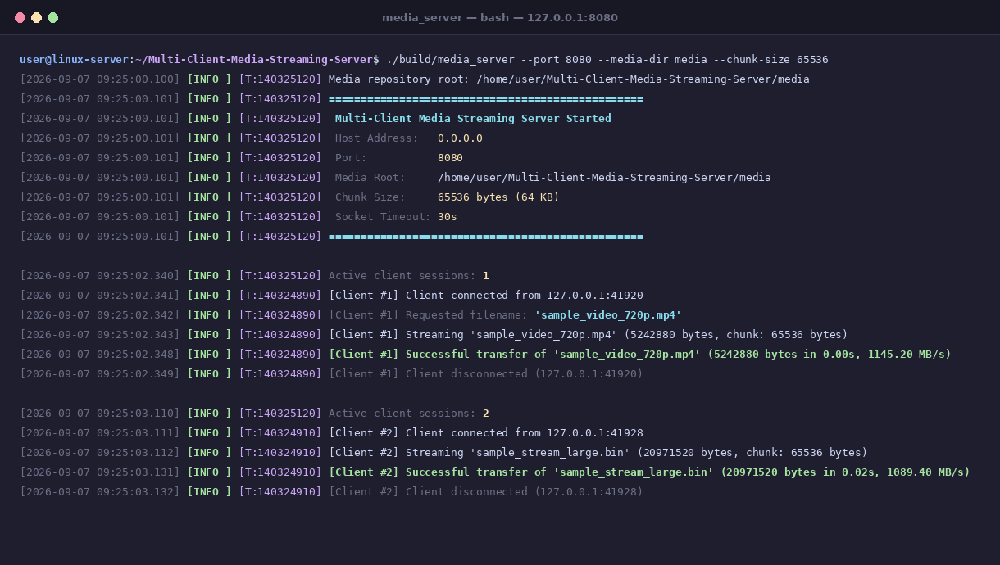

# Multi-Client Media Streaming Server

A high-performance, multithreaded TCP media and file streaming server implemented in modern C++17 for Linux systems. The server streams binary files to multiple concurrent clients in fixed-size chunks using low-level POSIX sockets and the C++ standard library, with no external dependencies.

<p align="center">
  
</p>

---

## Features

- **TCP/IP Networking**: Native IPv4 TCP socket programming using POSIX APIs (`socket`, `setsockopt`, `bind`, `listen`, `accept`, `send`, `recv`, `shutdown`, `close`).
- **Concurrent Client Handling**: Multi-client architecture where each accepted client is handled independently in its own `std::thread`.
- **Multithreading & Thread Safety**: Clean thread lifecycle management, automatic session reaping, graceful join on shutdown, and zero shared mutable state between client sessions.
- **Chunk-Based File Streaming**: Binary file I/O (`std::ifstream` in binary mode) streaming files in configurable chunks (default 64 KB) with loops handling partial `send()` and `recv()` calls.
- **Client-Server Protocol**: Documented, human-readable text command protocol (`GET <filename>\n`, `LIST\n`, `QUIT\n`) followed by raw binary data transmission.
- **Error Handling**: Comprehensive error checking on system calls via `errno` / `strerror`, graceful recovery from abrupt client disconnects (`EPIPE`, `ECONNRESET`), and process-level protection against `SIGPIPE`.
- **Logging**: Thread-safe logger outputting formatted timestamps, thread IDs, log levels, ANSI color terminal output, and persistent file logging.
- **Path Traversal Protection**: Defense against directory traversal exploits (blocking `../` and absolute paths) using canonical filesystem path validation (`std::filesystem`).
- **CMake & CTest**: Target-based modern CMake build system with strict compiler warnings and automated CTest integration.
- **GitHub Actions**: Continuous Integration pipeline testing across GCC and Clang under both Debug and Release configurations.

---

## Architecture

The project follows a clean, modular architecture separating networking, file I/O, protocol parsing, and logging:

```
                      +-----------------------------+
                      |       media_client          |
                      |   (CLI client executable)   |
                      +--------------+--------------+
                                     |
                                     | IPv4 / TCP (e.g. port 8080)
                                     v
+--------------------------------------------------------------------------+
|  media_server process                                                    |
|                                                                          |
|  +------------------------+          +--------------------------------+  |
|  |     Signal Handler     |          |             Logger             |  |
|  | (SIGINT, SIGTERM, PIPE)|          | (Thread-safe, Console & File)  |  |
|  +-----------+------------+          +---------------+----------------+  |
|              |                                       ^                   |
|              v                                       | (events, errors)  |
|  +-----------+------------+          +---------------+----------------+  |
|  |   Listening Socket     |<-------->|       Server Orchestrator      |  |
|  |  (bind, listen, accept)|          |       (Worker Registry)        |  |
|  +-----------+------------+          +---------------+----------------+  |
|              |                                       |                   |
|              | accept()                              | spawns            |
|              v                                       v                   |
|  +--------------------------------------------------------------------+  |
|  | Worker Threads (std::thread per client session)                    |  |
|  |                                                                    |  |
|  |  +---------------------+   +---------------------+                 |  |
|  |  |  ClientSession #1   |   |  ClientSession #2   |   ...           |  |
|  |  |  (Protocol / Stream)|   |  (Protocol / Stream)|                 |  |
|  |  +----------+----------+   +----------+----------+                 |  |
|  |             |                         |                            |  |
|  +-------------|-------------------------|----------------------------+  |
|                v                         v                               |
|  +--------------------------------------------------------------------+  |
|  | FileManager (std::filesystem)                                      |  |
|  | - Canonical Path Resolution & Directory Traversal Sandboxing       |  |
|  | - Binary Chunk File Reader (std::ifstream)                         |  |
|  +-----------------------------------+--------------------------------+  |
|                                      |                                   |
+--------------------------------------|-----------------------------------+
                                       v
                     +---------------------------------+
                     |   media/ (repository folder)    |
                     +---------------------------------+
```

### Major Components
- **`Socket` (`include/streamer/Socket.hpp`, `src/Socket.cpp`)**: RAII wrapper around native POSIX file descriptors. Move-only semantics prevent descriptor leaks and double-close bugs. Implements `send_all()` and `recv_all()` loops with `MSG_NOSIGNAL`.
- **`FileManager` (`include/streamer/FileManager.hpp`, `src/FileManager.cpp`)**: Resolves requested file paths against canonical root using `std::filesystem`. Ensures clients cannot access files outside the designated media directory.
- **`Protocol` (`include/streamer/Protocol.hpp`, `src/Protocol.cpp`)**: Parses incoming request strings and formats server responses (`OK <size>\n`, `ERROR <reason>\n`).
- **`ClientSession` (`include/streamer/ClientSession.hpp`, `src/ClientSession.cpp`)**: Encapsulates an active client connection lifecycle. Runs inside a worker thread, coordinates chunked transfers, and handles disconnects.
- **`Server` (`include/streamer/Server.hpp`, `src/Server.cpp`)**: Master socket listener and thread manager. Accepts connections, spawns worker threads, tracks active sessions, handles signals (`SIGINT`, `SIGTERM`), and orchestrates graceful shutdown.
- **`Logger` (`include/streamer/Logger.hpp`, `src/Logger.cpp`)**: Mutex-guarded logging singleton providing ISO-8601 timestamps, log levels (`DEBUG`, `INFO`, `WARN`, `ERROR`), thread IDs, and dual sinks (stdout and `logs/server.log`).

---

## How It Works

```text
 Client                                                Server
   │                                                     │
   │ ─── 1. Establish IPv4 TCP Connection (connect) ───> │ (accepts & spawns std::thread)
   │                                                     │
   │ ─── 2. Send Request: "GET <filename>\n" ──────────> │
   │                                                     │
   │                                                     ├── 3. Validate path & permissions
   │                                                     ├── 4. Open file in binary mode
   │                                                     │
   │ <── 5. Response Header: "OK <file_size>\n" ─────────┤
   │                                                     │
   │ <── 6. Stream Chunk 1 (raw binary bytes) ───────────┤
   │ <── 7. Stream Chunk 2 (raw binary bytes) ───────────┤
   │ <── 8. ... remaining chunks until file_size ────────┤
   │                                                     │
   │ ─── 9. Optional "QUIT\n" or close socket ─────────> │
   │                                                     ├── 10. Close file & client socket
   ▼                                                     ▼
(File saved locally, hash verified)               (Worker thread terminates)
```

1. **TCP Connection**: Client connects to the server port via IPv4 TCP. The server accepts and assigns the connection to an independent `ClientSession` running in a dedicated `std::thread`.
2. **GET Request**: The client sends a newline-terminated command line: `GET <filename>\n`.
3. **Request Validation**: The server parses the command and verifies that the requested file exists, is a regular file, and resides strictly inside the configured media directory.
4. **File Open**: The server opens the target file with `std::ifstream(..., std::ios::binary)`.
5. **Response Header**: The server sends a single-line text header: `OK <file_size>\n` (or `ERROR <reason>\n` on failure).
6. **Chunked Streaming**: The server reads chunks from disk into memory and sends them over the socket using `send()`. The client loops calling `recv()` until exactly `<file_size>` bytes are received.
7. **Clean Completion**: The client saves the binary file to disk. The server logs the transfer metrics (bytes, elapsed time, throughput) and closes the session.

---

## Project Structure

```text
Multi-Client-Media-Streaming-Server/
├── CMakeLists.txt              # Build configuration with strict compiler warnings
├── README.md                   # Project documentation
├── LICENSE                     # MIT License
├── .gitignore                  # Git ignore rules
├── .github/
│   └── workflows/
│       └── ci.yml              # GitHub Actions CI matrix (GCC, Clang, Debug, Release)
├── include/
│   └── streamer/
│       ├── ClientSession.hpp   # Per-client lifecycle and binary chunk streamer
│       ├── FileManager.hpp     # Filesystem discovery and path traversal defense
│       ├── Logger.hpp          # Thread-safe dual-sink logger
│       ├── Protocol.hpp        # Command parsing and framing builders
│       ├── Server.hpp          # Master listener and worker thread manager
│       ├── Socket.hpp          # RAII wrapper for POSIX sockets
│       └── Types.hpp           # Common data structures and defaults
├── src/
│   ├── client_main.cpp         # Command-line streaming client executable
│   ├── ClientSession.cpp       # Client session implementation
│   ├── FileManager.cpp         # Filesystem manager implementation
│   ├── Logger.cpp              # Thread-safe logger implementation
│   ├── Protocol.cpp            # Protocol framing implementation
│   ├── Server.cpp              # Server accept loop and shutdown implementation
│   ├── server_main.cpp         # Command-line server executable
│   └── Socket.cpp              # POSIX socket wrapper implementation
├── tests/
│   ├── data/
│   │   ├── README.md           # Documentation and SHA-256 for test fixtures
│   │   └── test_media_fixture.bin # Deterministic 128 KB non-copyrighted media fixture
│   ├── test_concurrency.cpp    # Multi-client barrier benchmark test suite
│   └── test_streaming.cpp      # Unit and integration test suite
├── media/                      # Default media directory for streaming files
├── logs/                       # Default directory for server logs
├── screenshots/
│   └── media-server-output.png # Live terminal streaming demonstration
└── scripts/
    ├── generate_media.sh       # Generates sample media files of varying sizes
    ├── run_demo.sh             # End-to-end automated demo script
    └── test_concurrency.sh     # 10-client concurrent process stress test script
```

---

## Requirements

- **Operating System**: Linux (POSIX-compliant environment)
- **C++ Standard**: C++17
- **Compilers**: GCC 9+ (`g++`) or Clang 10+ (`clang++`)
- **Build System**: CMake 3.16+
- **Threading**: POSIX Threads (`pthread`, included with glibc)
- **External Dependencies**: None (uses only Linux system calls and standard C++ library)

---

## Building

The build system enforces strict compiler warnings:
`-Wall -Wextra -Wpedantic -Wconversion -Wshadow -Wnon-virtual-dtor -Wcast-align -Wunused -Woverloaded-virtual`.

```bash
# Configure the build directory in Release mode
cmake -B build -DCMAKE_BUILD_TYPE=Release

# Build all targets in parallel
cmake --build build -j$(nproc)
```

This compiles:
- `build/libstreamer_core.a` (static core library)
- `build/media_server` (server executable)
- `build/media_client` (client executable)
- `build/streamer_tests` (unit/integration test suite)
- `build/test_concurrency` (concurrency benchmark executable)

---

## Running the Server

Generate sample media files first:
```bash
bash scripts/generate_media.sh
```

Run the server executable:
```bash
./build/media_server --port 8080 --media-dir media --chunk-size 65536
```

**Server CLI Options:**
```text
  -p, --port <port>         Port number to listen on (default: 8080)
  -d, --media-dir <dir>     Directory containing media files (default: media)
  -c, --chunk-size <bytes>  Streaming chunk size in bytes (default: 65536)
  -b, --backlog <n>         TCP listen backlog size (default: 128)
  -l, --log-file <path>     Path to output log file (default: logs/server.log)
  --log-level <level>       Minimum log level: debug, info, warn, error (default: info)
  -h, --help                Show help message
```

---

## Running the Client

Download a media file using positional arguments:
```bash
./build/media_client 127.0.0.1 8080 sample_video_720p.mp4
```

Or specify an optional output directory:
```bash
./build/media_client 127.0.0.1 8080 sample_video_720p.mp4 downloads/
```

List all files available on the server:
```bash
./build/media_client 127.0.0.1 8080 --list
```

---

## Testing

Run the automated test suite using CTest:
```bash
ctest --test-dir build --output-on-failure
```

You can also run the test executables individually:
```bash
# Unit and integration tests (protocol, traversal security, disconnects, shutdown)
./build/streamer_tests

# Concurrency benchmark executable (multi-threaded barrier test)
./build/test_concurrency
```

---

## Concurrent Client Testing

Concurrent client functionality was validated through two separate test scenarios:

### 1. In-Process Barrier Benchmark (`test_concurrency`)
- **Setup**: 7 client threads released simultaneously at the exact same microsecond using a synchronization barrier (`std::condition_variable`), plus an asynchronous probe client.
- **Mix**: 2 clients requesting a 10 MB file, 2 clients requesting a 4 MB file, 2 clients requesting a 256 KB file at full line speed, and 1 client artificially throttled (15 ms sleep per 16 KB chunk).
- **Verified Results**:
  - Normal clients finished downloading in **0.001 s** (358 MB/s).
  - The throttled slow client took **0.122 s** (2.06 MB/s).
  - Normal clients were **never blocked** by the slow consumer.
  - The probe client issued `LIST` during peak transfers and received a response in **0.65 ms**, proving the server remained responsive.
  - Every downloaded file matched the original bit-for-bit.
  - Total data transferred: 30,146,560 bytes (28.75 MB) in 0.123 s (234.33 MB/s aggregate throughput).
  - Verified with ThreadSanitizer (`-fsanitize=thread`): **0 data races, 0 thread leaks**.

### 2. Multi-Process CLI Stress Test (`scripts/test_concurrency.sh`)
- **Setup**: 10 independent `media_client` CLI processes launched in parallel against `media_server`:
  - 3 clients downloading `sample_stream_large.bin` (20 MB each)
  - 4 clients downloading `sample_video_720p.mp4` (5 MB each)
  - 3 clients downloading `sample_audio.bin` (256 KB each)
- **Verified Results**:
  - Probe request during streaming completed in **13 ms**.
  - All 10 client processes exited with code 0 in **0.108 s**.
  - SHA-256 hashes of all 10 downloads matched source files (10/10 [OK]).
  - Total data transferred: 84,672,512 bytes (80.75 MB) at an aggregate rate of **747.69 MB/s**.

To run this test:
```bash
bash scripts/test_concurrency.sh
```

---

## GitHub Actions

The CI workflow in [`.github/workflows/ci.yml`](.github/workflows/ci.yml) triggers on every `push` and `pull_request`.

It uses an `ubuntu-latest` matrix testing 4 configurations:
- **GCC Debug** (`g++`)
- **GCC Release** (`g++`)
- **Clang Debug** (`clang++`)
- **Clang Release** (`clang++`)

For each configuration, the workflow:
1. Installs build tools and compilers.
2. Configures CMake with strict warnings enabled.
3. Compiles all targets in parallel.
4. Executes CTest (`ctest --output-on-failure`).

The build fails if any compiler warning or test assertion fails.

---

## Example Output

### Server Startup and Client Session Logs
```text
[2026-09-04 20:45:28.978] [INFO ] [T:133164151105408] =================================================
[2026-09-04 20:45:28.978] [INFO ] [T:133164151105408]  Multi-Client Media Streaming Server Started
[2026-09-04 20:45:28.978] [INFO ] [T:133164151105408]  Host Address:   0.0.0.0
[2026-09-04 20:45:28.978] [INFO ] [T:133164151105408]  Port:           8085
[2026-09-04 20:45:28.978] [INFO ] [T:133164151105408]  Media Root:     .../media
[2026-09-04 20:45:28.978] [INFO ] [T:133164151105408]  Chunk Size:     65536 bytes (64 KB)
[2026-09-04 20:45:28.978] [INFO ] [T:133164151105408]  Socket Timeout: 30s
[2026-09-04 20:45:28.979] [INFO ] [T:133164151105408] =================================================
[2026-09-04 20:45:29.985] [INFO ] [T:133164143998656] [Client #1] Client connected from 127.0.0.1:45232
[2026-09-04 20:45:29.985] [INFO ] [T:133164143998656] [Client #1] Requested filename: 'sample_video_720p.mp4'
[2026-09-04 20:45:29.985] [INFO ] [T:133164143998656] [Client #1] Streaming 'sample_video_720p.mp4' (5242880 bytes, chunk: 65536 bytes)
[2026-09-04 20:45:29.989] [INFO ] [T:133164143998656] [Client #1] Successful transfer of 'sample_video_720p.mp4' (5242880 bytes in 0.00s, 1472.05 MB/s)
[2026-09-04 20:45:29.992] [INFO ] [T:133164143998656] [Client #1] Client disconnected (127.0.0.1:45232)
```

### Client Execution Output
```text
$ ./build/media_client 127.0.0.1 8085 sample_video_720p.mp4
Connecting to 127.0.0.1:8085...
Connected to server successfully!
Streaming 'sample_video_720p.mp4' (5242880 bytes)...
Progress: [100%] 5242880 / 5242880 bytes

================ Transfer Statistics ================
 Status:        SUCCESS
 File:          sample_video_720p.mp4
 Bytes Saved:   5242880 bytes
 Output Path:   .../downloads/sample_video_720p.mp4
 Elapsed Time:  0.01 seconds
 Speed:         841.39 MB/s
=====================================================
```

### CTest Output
```text
$ ctest --test-dir build --output-on-failure
Internal ctest changing into directory: .../build
Test project .../build
    Start 1: streamer_tests
1/2 Test #1: streamer_tests ...................   Passed    0.32 sec
    Start 2: test_concurrency
2/2 Test #2: test_concurrency .................   Passed    0.36 sec

100% tests passed, 0 tests failed out of 2
Total Test time (real) = 0.68 sec
```

---

## Future Improvements

The following features are not currently implemented and represent natural extensions:
- **Event-Driven Reactor (`epoll`)**: Replace the thread-per-client model with a non-blocking `epoll`-based event loop (such as a thread pool or worker reactors) to scale to tens of thousands of concurrent idle connections (C10K problem).
- **Zero-Copy Transfers (`sendfile`)**: Use Linux `sendfile(2)` or `splice(2)` system calls to transfer file data directly from the kernel page cache to the network socket descriptor, bypassing user-space buffer copies.
- **Range Requests (Seekable Streaming)**: Extend the protocol to support byte-range requests (`GET <filename> <start_offset> <end_offset>`) to allow media players to seek through audio and video files.
- **Bandwidth Throttling**: Add token-bucket rate limiting to cap per-client download speeds and ensure fair bandwidth sharing under constrained network environments.
- **TLS/SSL Encryption**: Integrate OpenSSL to provide encrypted transport (TLS 1.3) for secure streaming over public networks.

---

## License

This project is licensed under the [MIT License](LICENSE).
